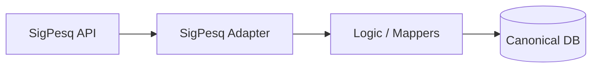

# Senior ETL & Data Documentation Standards

As a Senior ETL Specialist, your documentation must bridge the gap between business requirements and technical implementation, ensuring observability, maintainability, and data integrity.

## 1. Core Documentation Components

### 1.1 Data Source Catalog
For every source integrated, document:
- **Origin**: System name, technology (API, SQL, File).
- **Format**: JSON, CSV, XML, etc.
- **Authentication**: How to access (Environment variables required).
- **Latency/Frequency**: Batch vs Real-time, update intervals.

### 1.2 Data Mapping Matrix (DMM)
Use tables to define transformations clearly:
| Source Field | Transformation Logic | Target Field | Type | Rules |
|--------------|----------------------|--------------|------|-------|
| `ano_inicio` | `int(val)` | `start_date` | Date | Default to Jan 1st |
| `situacao`   | Mapping table | `status` | Enum | Active/Concluded |

### 1.3 Data Lineage & Flow
Use Mermaid diagrams to visualize paths:

### 1.4 Error Handling & DLQ (Dead Letter Queues)
Document how the system reacts to:
- Missing fields.
- Type mismatches.
- Network timeouts.
- Duplicate records (Idempotency strategy).

### 1.5 Data Dictionary
Maintain a clear schema definitions for the Canonical Domain:
- **Entities**: Initiatives, Persons, Organizations, Teams.
- **Relations**: 1:N, N:N.
- **Constraints**: Unique keys, non-nullable fields.

## 2. Documenting a New Flow

When creating or modifying a Prefect Flow, always provide an accompanying technical document (or update the SDD) following these headers:
1. **Objective**: Business value of this data.
2. **Architecture**: Which adapters and strategies are used.
3. **Mappers**: Reference the transformation logic files.
4. **Verification**: How to validate the data in the target (SQL queries or JSON inspections).

## 3. Best Practices
- **Conciseness over Volume**: Use diagrams and tables instead of long paragraphs.
- **Versioning**: Document snapshots of the schema.
- **Automation**: Reference scripts that auto-generate documentation from code if available.
