```mermaid
---
title: Canonical Export vs Dashboard Data
---
flowchart TB
    subgraph ZIP["📦 canonical_export_20260706_133358.zip  (338 MB)"]
        direction TB

        subgraph CE["Canonical Entities  (raw snapshots)"]
            RE["researchers_canonical.json<br/>9.220 researchers"]
            IN["initiatives_canonical.json<br/>3.532 initiatives"]
            AR["articles_canonical.json<br/>1.801 articles"]
            RG["research_groups_canonical.json<br/>343 groups"]
            ST["students_canonical.json<br/>5.914 students"]
            AD["advisorships_canonical.json<br/>174 advisorships"]
            RO["researchers_only_canonical.json<br/>2.468 researchers-only"]
            SR["source_records_canonical.json<br/>17.870 source records"]
        end

        subgraph TR["Tracking & Provenance"]
            RT["researchers_tracking.json<br/>6.496 tracking entries"]
            IT["initiatives_tracking.json"]
            AT["advisorships_tracking.json<br/>2.697 entries"]
            CL["entity_change_logs_canonical.json<br/>19.096 logs"]
            EM["entity_matches_canonical.json<br/>17.727 matches"]
            AA["attribute_assertions_canonical.json<br/>89.122 assertions"]
        end

        subgraph MA["Marts  (dashboard-ready analytics)"]
            IAM["initiatives_analytics_mart.json<br/>35 KB<br/>summary, evolution, rankings"]
            KAM["knowledge_areas_mart.json<br/>714 KB<br/>1.509 areas → groups → campuses"]
            AAM["advisorship_analytics.json<br/>77 KB<br/>KPIs, top-10 rankings"]
        end

        subgraph GR["Graphs  (network data)"]
            PRG["people_relationship_graph.json<br/>71 MB"]
            SRG["students_relationship_graph.json<br/>29 MB"]
            RORG["researchers_only_relationship_graph.json<br/>13 MB"]
            RSG["research_group_relationship_graphs/<br/>343 subgraphs"]
            CG["*_collaboration_graph.json<br/>5 files"]
        end
    end

    subgraph DB["📊 Dashboard Data  (what the UI consumes)"]
        direction TB

        subgraph DBM["Marts"]
            DIAM["initiatives_analytics_mart.json<br/>KPI cards, evolution charts"]
            DKAM["knowledge_areas_mart.json<br/>area filters, group lists"]
            DAAM["advisorship_analytics.json<br/>project tables, rankings"]
        end

        subgraph DBG["Graphs"]
            DPRG["people_relationship_graph<br/>network visualization"]
            DSRG["students_relationship_graph<br/>student network"]
            DRSG["research_group graphs<br/>per-group subgraphs"]
        end

        subgraph DBE["Canonical Lookups"]
            DRE["researchers_canonical.json<br/>profile pages"]
            DIN["initiatives_canonical.json<br/>initiative detail"]
            DRG["research_groups_canonical.json<br/>group detail"]
        end
    end

    CE -->|"entity data<br/>for detail views"| DBE
    MA -->|"pre-aggregated KPIs<br/>fast dashboards"| DBM
    GR -->|"graph layout & edges<br/>for D3/Vis.js"| DBG

    TR -.->|"not served to dashboard<br/>(audit only)"| X["❌ Excluded from dashboard"]
    SR -.->|"not served to dashboard"| X
    AA -.->|"not served to dashboard<br/>(too granular)"| X
    CL -.->|"not served to dashboard"| X
    EM -.->|"not served to dashboard"| X
    ST -.->|"students usually merged<br/>into people graph"| DBE

    style ZIP fill:#1a1a2e,color:#fff,stroke:#e94560
    style DB fill:#16213e,color:#fff,stroke:#0f3460
    style CE fill:#162447,color:#ccc
    style TR fill:#1b1b2f,color:#999
    style MA fill:#1a3a4a,color:#eee
    style GR fill:#2d1b2e,color:#eee
    style DBM fill:#1a3a4a,color:#eee
    style DBG fill:#2d1b2e,color:#eee
    style DBE fill:#162447,color:#ccc
    style X fill:#3d1a1a,color:#ff6b6b
```

## Summary

| Aspect | Canonical Export ZIP | Dashboard Data |
|---|---|---|
| **Purpose** | Complete system snapshot (audit, restore, lineage) | Fast, pre-computed visualizations |
| **Files** | 35+ files, 338 MB | ~10 files, ~100 MB subset |
| **Record-level** | Yes — all raw entities | Only for detail drill-downs |
| **Pre-aggregated** | No (except 3 mart files) | Yes — KPIs, evolutions, rankings |
| **Tracking/provenance** | Yes — 6 files, 90 MB | No — excluded |
| **Graphs** | All 15+ graph variants | Subset: people, students, groups |
