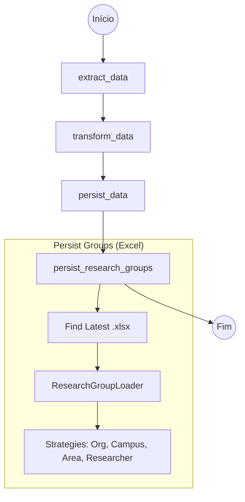
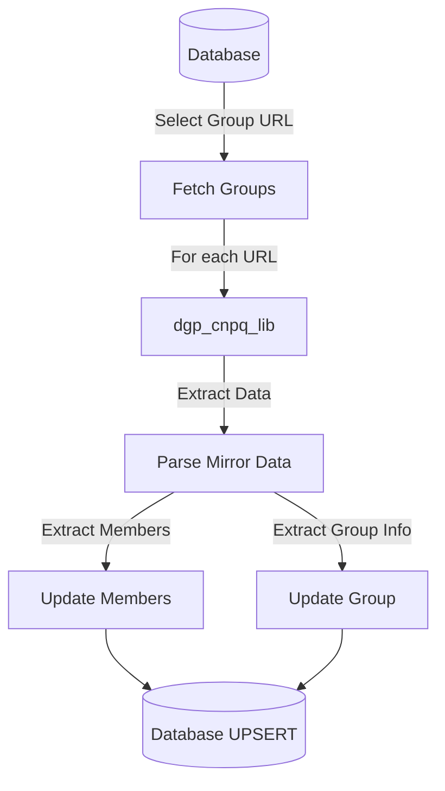
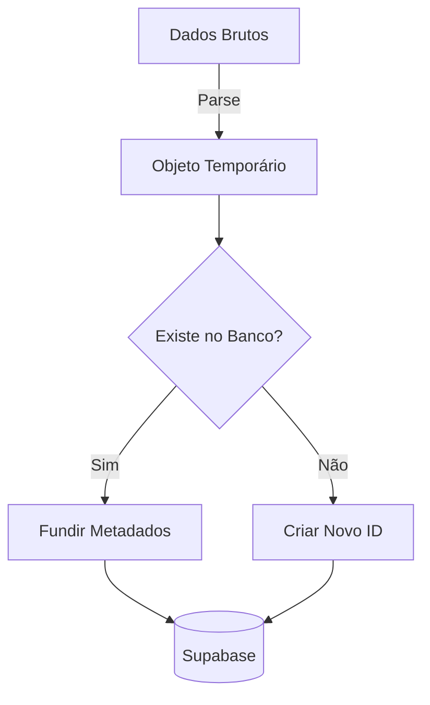
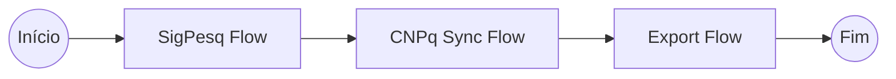
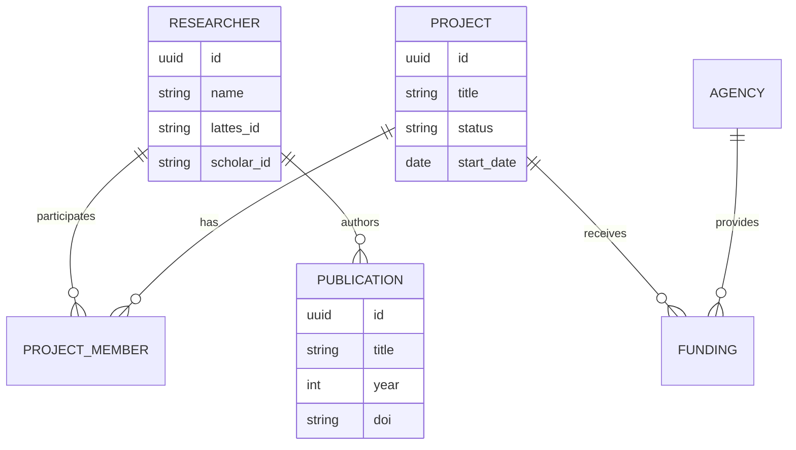

# SI.2 – Análise do Software
**Projeto:** Horizon ETL
**Versão:** 1.0
**Responsável:** Antigravity (Senior Analyst)

---

## 1. Objetivo do Documento
Modelar o domínio de Dados Acadêmicos e desenhar os fluxos de orquestração do pipeline ETL.

---

## 2. Entendimento do Domínio
O domínio central é a **Produção Acadêmica e Científica**.
Conceitos Chave:
- **Pesquisador**: Ator central (Professor/Aluno).
- **Produção**: Artigo, Livro, Patente.
- **Projeto**: Iniciativa financiada ou voluntária.
- **Instituição/Órgão**: IFES, FAPES, CNPq.

---

## 3. Modelagem de Processos (Prefect Flows)

### 3.1 Fluxo de Ingestão SigPesq


### 3.2 Fluxo de Atualização CNPq (DGP)


### 3. strategy de Normalização (Lattes/Scholar)


### 3.4 Fluxo de Exportação Canônica
```mermaid
flowchart TD
    Start((Início)) --> Org[Export Orgs]
    Start --> Cam[Export Campuses]
    Start --> KA[Export Knowledge Areas]
    Start --> Res[Export Researchers]
    Start --> RG[Export Research Groups]
    
    Start --> Res[Export Researchers]
    Start --> RG[Export Research Groups]
    
    Org & Cam & KA & RG --> End((Fim))
    Res --> Enrichment[Enrich with Groups/KAs/Initiatives] --> End
    
    subgraph "Output Files"
        Org -.-> f1["organizations_canonical.json"]
        Cam -.-> f2["campuses_canonical.json"]
        KA -.-> f3["knowledge_areas_canonical.json"]
        Res -.-> f4["researchers_canonical.json"]
        RG -.-> f5["research_groups_canonical.json"]
    end

### 3.6 Fluxo de Geração de Mart de Analytics
```mermaid
flowchart TD
    DB[(Database)] --> Initiatives[Fetch Initiatives]
    DB --> TeamMembers[Fetch Team Members]
    Initiatives --> Summary[Calculate Totals/Active]
    Initiatives --> Evolution[Analyze Start/End Dates by Year]
    TeamMembers --> Composition[Count by Role: Researcher/Student]
    Summary & Evolution & Composition --> SaveMart[Save initiatives_analytics_mart.json]
```
```

### 3.5 Pipeline Unificado (E2E)


---

## 4. Modelo Conceitual (ER Diagram)
Diagrama de Entidade-Relacionamento macro para o Supabase.



---

## 5. Regras de Negócio (ETL)
| Regra | Descrição | Impacto |
|--------|-------------|----------|
| **RN-01** | **Prioridade de Fonte** | Se dados conflitarem (ex: Título), Lattes tem prioridade sobre Scholar. | Transform Layer |
| **RN-02** | **Desduplicação** | Publicações devem ser desduplicadas por DOI ou Título normalizado. | Load Layer |
| **RN-03** | **Histórico** | Manter log de quando o dado foi extraído/atualizado (`updated_at`). | Database |
| **RN-04** | **Observabilidade** | Todas as ações (Start, End, Error) devem ser logadas com Contexto. | System-wide |
| **RN-05** | **Idempotência Estrita (SigPesq)** | Se um Pesquisador (por email) ou Grupo de Pesquisa (por nome) já existir, o sistema deve ignorar a criação e não realizar atualizações destas entidades base. | Load Layer (Strategies) |
| **RN-06** | **Geração de Mart** | O Data Mart de Áreas deve ser gerado consultando diretamente o Banco de Dados via Controllers, garantindo dados em tempo real. | Transform Layer |

---

## 6. Rastreabilidade (SI.1 → SI.2)
| Requisito | Elemento da Análise |
|-----------|----------------------|
| RF-01 (SigPesq) | Entidade `PROJECT`, Fluxo 3.1 |
| RF-02 (Lattes) | Entidade `RESEARCHER`, `PUBLICATION`, Fluxo 3.2 |
| RF-08 (Canonical JSON) | Fluxo de Exportação (User Req. logic) |
| RF-09 (CNPq Update) | Fluxo 3.2, dgp_cnpq_lib |
| RF-11 (KA Mart) | Fluxo de Geração de Mart (RN-06) |
| RF-13 (Analytics Mart) | Fluxo 3.6, Geração de Mart |