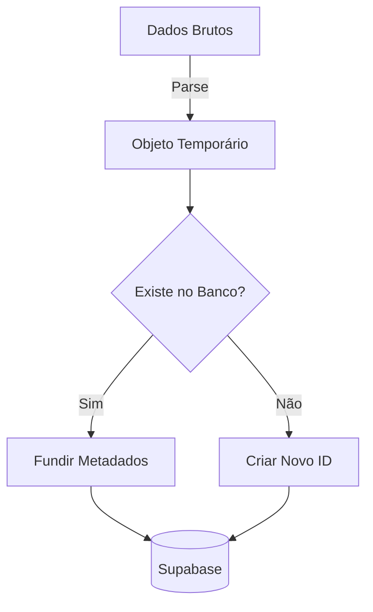
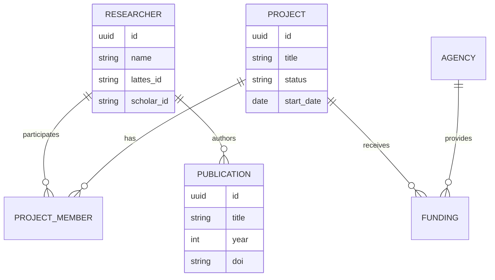

# SI.2 – Análise do Software
**Projeto:** Horizon ETL
**Versão:** 1.0
**Responsável:** Antigravity (Senior Analyst)

---

## 1. Objetivo do Documento
Modelar o domínio de Dados Acadêmicos e desenhar os fluxos de orquestração do pipeline ETL.

---

## 2. Entendimento do Domínio
O domínio central é a **Produção Acadêmica e Científica**.
Conceitos Chave:
- **Pesquisador**: Ator central (Professor/Aluno).
- **Produção**: Artigo, Livro, Patente.
- **Projeto**: Iniciativa financiada ou voluntária.
- **Instituição/Órgão**: IFES, FAPES, CNPq.

---

## 3. Modelagem de Processos (ETL Flow)

### 3.1 Fluxo Geral de Extração
```mermaid
flowchart LR
    Start([Scheduler/Trigger]) --> Extract[Extração (Raw Data)]
    Extract -->|Log Success/Fail| Transform[Transformação (Domain Model)]
    Transform -->|Log Logic| Load{Idempotent Load}
    Load -->|New Resource| Insert[Insert DB]
    Load -->|Existing Resource| Update[Update DB]
    Insert -->|Log Action| End([Fim])
    Update -->|Log Action| End
```

### 3.2 Estratégia de Normalização (Lattes/Scholar)


---

## 4. Modelo Conceitual (ER Diagram)
Diagrama de Entidade-Relacionamento macro para o Supabase.



---

## 5. Regras de Negócio (ETL)
| Regra | Descrição | Impacto |
|--------|-------------|----------|
| **RN-01** | **Prioridade de Fonte** | Se dados conflitarem (ex: Título), Lattes tem prioridade sobre Scholar. | Transform Layer |
| **RN-02** | **Desduplicação** | Publicações devem ser desduplicadas por DOI ou Título normalizado. | Load Layer |
| **RN-03** | **Histórico** | Manter log de quando o dado foi extraído/atualizado (`updated_at`). | Database |
| **RN-04** | **Observabilidade** | Todas as ações (Start, End, Error) devem ser logadas com Contexto. | System-wide |

---

## 6. Rastreabilidade (SI.1 → SI.2)
| Requisito | Elemento da Análise |
|-----------|----------------------|
| RF-01 (SigPesq) | Entidade `PROJECT`, Fluxo 3.1 |
| RF-02 (Lattes) | Entidade `RESEARCHER`, `PUBLICATION`, Fluxo 3.2 |
| RNF-01 (Idempotência) | Fluxo 3.1 (Load Step), RN-02 |