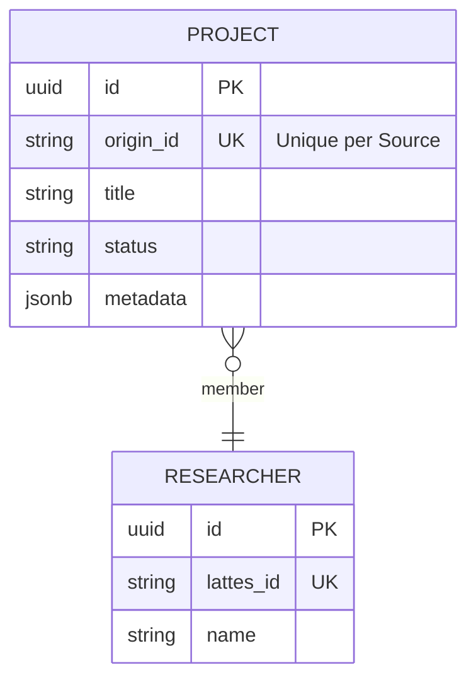

# SI.3 – Projeto de Software (Design)
**Projeto:** Horizon ETL
**Versão do Documento:** 1.0
**Data:** 06/01/2026
**Responsável pelo Design:** Antigravity (Senior Designer)

---

## 1. Objetivo do Documento
Definir a Arquitetura Hexagonal e os padrões de design para o Horizon ETL, garantindo desacoplamento, testabilidade e idempotência.

---

## 2. Visão Geral da Arquitetura
**Estilo Arquitetural:** Hexagonal Architecture (Ports & Adapters)
**Padrão de Integração:** ETL (Extract, Transform, Load) com Orchestration.

**Diretrizes:**
- **Core (Hexagon/Logic)**: Contém as regras de negócio puras, entidades e interfaces (Ports). Não depende de frameworks externos ou bancos de dados.
- **Adapters (Infrastructure)**: Implementações concretas das interfaces (Sources = Scrapers/APIs; Sinks = Supabase/Files).
- **Flows (Orchestration)**: Onde os componentes são "plugados" e executados via Prefect.

---

## 3. Arquitetura de Componentes

### 3.1 Diagrama de Componentes (Mermaid)
```mermaid
flowchart TD
    subgraph Orchestration [src/flows]
        Flow[Prefect Flow]
    end

    subgraph Core [src/core]
        PortSource[<Interface>\nISource]
        PortSink[<Interface>\nISink]
        Logic[Business Logic\nMappers]
        Domain[Domain Entities]
    end

    subgraph Adapters [src/adapters]
        SigPesq[SigPesq Source]
        Lattes[Lattes Source]
        Fapes[Fapes API Client]
        Supabase[Supabase Sink]
        JsonFile[JSON File Sink]
    end

    %% Dependency Injection (Orchestration)
    Flow -.-> PortSource
    Flow -.-> PortSink

    %% Data Flow (ETL)
    PortSource == 1. Extract (Raw Data) ==> Logic
    Logic == 2. Transform (Domain Entities from Lib) ==> PortSink
    PortSink == 3. Load (Persist) ==> ResearchDomainLib
    
    SigPesq --implements--> PortSource
    Lattes --implements--> PortSource
    Fapes --implements--> PortSource
    
    JsonFile --implements--> PortSink
    
    %% External Libraries
    subgraph SharedKernel [Shared Libraries]
        ResearchDomainLib[Research Domain Lib\n(Entities & Repositories)]
    end
    
    Logic -.uses.-> ResearchDomainLib
    Supabase --extends--> ResearchDomainLib
```

### 3.2 Estrutura de Diretórios (Consolidada)
```text
src/
├── core/                  # BUSINESS RULES (Pure Python)
│   ├── ports/             # Interfaces (Abstract Base Classes)
│   ├── domain/            # Entities (Pydantic Models)
│   └── logic/             # Transformations (Mappers, Cleaners)
│
├── adapters/              # INFRASTRUCTURE (I/O)
│   ├── sources/           # Extractors (Scrapers, API Clients)
│   └── sinks/             # Loaders (Supabase, S3, FileSystem)
│
└── flows/                 # ORCHESTRATION (Prefect)
    └── <flow_name>.py     # Dependency Injection & Execution
```

---

## 4. Modelagem de Dados (Schema Simplificado)

O Banco de Dados (Supabase) reflete as Entidades do Domínio.


*Detalhes completos no SI.2 Análise.*

---

## 5. Interfaces e Contratos (Ports)

### 5.1 ISource (`src/core/ports/source.py`)
Contrato para extração de dados.
```python
class ISource(ABC):
    @abstractmethod
    def extract(self) -> List[RawData]:
        """Extrai dados brutos da fonte."""
        pass
```

### 5.2 ISink (`src/core/ports/sink.py`)
Contrato para carga de dados (Idempotent).
```python
class ISink(ABC):
    @abstractmethod
    def load(self, data: List[DomainEntity]) -> LoadStats:
        """Persiste dados cuidando de Upserts/Deduplicação."""
        pass

class IExportSink(ABC):
    @abstractmethod
    def export(self, data: List[DomainEntity], path: str) -> None:
        """Exporta entidades para um formato de arquivo."""
        pass
```

---

## 6. Decisões de Design (ADRs)

| ID | Decisão | Justificativa |
|----|---------|---------------|
| **D1** | **Prefect para Orquestração** | Suporte nativo a Retries, Caching e Observabilidade. |
| **D2** | **Supabase como Sink Único** | Simplificação da infraestrutura e API REST automática. |
| **D3** | **Flows Separados** | `src/flows` isola o framework de orquestração do Core. |
| **D4** | **Consolidação no Core** | Todas as regras e interfaces vivem em `src/core` para evitar dependências circulares. |

---

## 7. Rastreabilidade
- **SI.1 Requirements**: Mapeados para **Flows**.
- **SI.2 API/DB**: Mapeados para **Sinks** e **Domain**.
