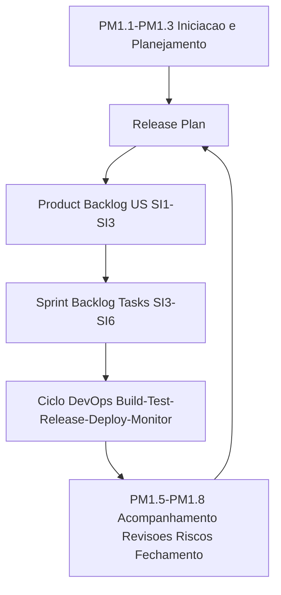

# SDLC – Software Development Life Cycle | ConectaFapes

Este repositório centraliza todo o **processo de desenvolvimento de software (SDLC)** utilizado no **ConectaFapes**, garantindo que cada etapa — desde a concepção até a operação — siga um fluxo **padronizado, rastreável, auditável e colaborativo**, alinhado simultaneamente à:

- **ISO/IEC 29110 (PM1.1–PM1.8 e SI.1–SI.6)**  
- **Métodos Ágeis (Scrum / XP)**  
- **Cultura DevOps (Ciclo Contínuo)**  

---

# 1. O que é SDLC

**SDLC (Software Development Life Cycle)** define como o software é planejado, analisado, projetado, desenvolvido, testado, implantado e mantido.  
Seu propósito é assegurar que os sistemas sejam entregues com:

- Qualidade  
- Previsibilidade  
- Rastreabilidade  
- Governança  
- Alinhamento institucional  

O SDLC do ConectaFapes integra práticas clássicas, ISO 29110, Scrum e DevOps em um ciclo contínuo:

```
Discovery → Concepção → Construção → Entrega → Operação → Monitoramento → Melhoria Contínua
```

---

# 2. Objetivo deste Repositório

Este repositório é a **fonte única de verdade (SSOT)** do processo de engenharia do ConectaFapes. Aqui são versionados:

- **Templates oficiais** (Business Case, Release Plan, Product Backlog, Sprint Backlog, ADRs, Testes, etc.)
- **Diagramas e BPMN**
- **Padrões de versionamento, governança e documentação**
- **Fluxos padronizados de desenvolvimento e entrega**
- **Diretrizes DevOps, CI/CD e qualidade**
- **Políticas institucionais de engenharia**

---

# 3. Macro Estrutura do SDLC do ConectaFapes

Conforme alinhado à ISO 29110, o processo se divide em duas grandes macrofases:

### **Fase de Concepção (SI.1 → SI.3 + PM1.1–PM1.3)**  
Envolve:

- Entendimento do problema  
- Levantamento e análise dos requisitos (SI.1 e SI.2)  
- Modelagem de processos e UX  
- Arquitetura e design técnico (SI.3)  
- Iniciação e planejamento do projeto (PM1.1–PM1.3)  
- Criação do Release Plan  

### **Fase de Construção (SI.4 → SI.6 + PM1.4–PM1.8)**  
Envolve:

- Estimativas e alocação (PM1.4)  
- Desenvolvimento incremental (SI.4)  
- Testes e QA (SI.5)  
- Entrega/implantação (SI.6)  
- Acompanhamento, revisão, riscos e encerramento (PM1.5–PM1.8)  

---

# 4. Integração com Scrum e DevOps

Cada Sprint funciona como um **microciclo SDLC**, cobrindo:

```
Plan → Code → Build → Test → Release → Deploy → Operate → Monitor
```

Este ciclo conecta:

- **Planejamento Ágil (Scrum)**
- **Engenharia e Boas Práticas (XP)**
- **Automação CI/CD (DevOps)**
- **Entrega Contínua (CD)**
- **Monitoramento e Feedback Contínuo**

---

# 5. Ciclo DevOps dentro do SDLC

| Etapa | Objetivo | Exemplos | Entregáveis |
|--------|----------|-----------|-------------|
| **Plan** | Gerar e priorizar backlog | Refinamento, critérios | US, Sprint Backlog |
| **Code** | Desenvolver valor | Implementação, refatorações | Código, ADRs |
| **Build** | Compilar e validar | Pipelines, lint, SCA | Artefatos de build |
| **Test** | Garantir qualidade | Testes, cobertura | Relatórios QA |
| **Release** | Consolidar entregas | Versionamento, changelog | Release Notes |
| **Deploy** | Implantar em ambiente | ArgoCD, IaC | Deploy validado |
| **Operate** | Garantir estabilidade | Logs, diagnóstico | Guias de operação |
| **Monitor** | Telemetria contínua | Métricas, traces | Painéis e alertas |

---

# 6. Tipos de Tasks no Ciclo SDLC/Scrum

| Tipo | Objetivo | Entregáveis |
|------|-----------|--------------|
| **User Story (US)** | Entregar valor | Código + testes + docs |
| **UX** | Fluxos e protótipos | BPMN, wireframes |
| **Design Técnico** | Arquitetura e SI.3 | Diagramas, ADRs |
| **Técnica** | Infra e suporte | Terraform, CI/CD |
| **Documentação** | Registrar conhecimento | Manuais, guias |
| **QA** | Garantir qualidade | Evidências de teste |
| **Operação** | Deploy e monitoramento | Logs, métricas |

---

# 7. Fluxo de Mapeamento entre Artefatos  
*(Release Plan → Product Backlog → Sprint Backlog)*

Esta seção estabelece como conectar, de forma rastreável e auditável, o planejamento (PM) às atividades de engenharia (SI).

É a espinha dorsal do SDLC.

---

## 7.1 Mapeamento Completo: ISO 29110 (PM1.1–PM1.8) → Artefatos Ágeis

| Processo ISO | Finalidade | Artefato Ágil |
|--------------|-----------|----------------|
| PM1.1 | Iniciação | Business Case |
| PM1.2 | Escopo/WBS | Product Backlog |
| PM1.3 | Plano/Release | Release Plan |
| PM1.4 | Recursos | Estimativa de US e capacity |
| PM1.5 | Acompanhamento | Sprint Backlog / Board |
| PM1.6 | Revisões | Sprint Review |
| PM1.7 | Riscos | Quadro de riscos / alerts |
| PM1.8 | Encerramento | Release Notes + Retro |
| SI.1 | Requisitos | Web de US + critérios |
| SI.2 | Análise | BPMN + regras |
| SI.3 | Design | Arquitetura/ADRs |
| SI.4 | Implementação | Tasks DEV |
| SI.5 | Testes | Evidências QA |
| SI.6 | Entrega | Deploy validado |

---

## 7.2 Do Release Plan → Product Backlog

O Release Plan é um artefato PM1.3.  
Ele organiza entregas macro (R1, R2, R3).

Cada release origina um conjunto de US:

```
R1:
  - US-001
  - US-002
  - US-003
```

Regras:

- Milestone definida (`R1`)  
- Labels padronizados (`type:us`)  
- Critérios de aceitação derivados de SI.1–SI.2  
- Dependências associadas às análises e ao design (SI.3)

---

## 7.3 Do Product Backlog → Sprint Backlog

Durante o Sprint Planning:

1. Selecionam-se US prioritárias  
2. Cada US é quebrada em tasks coerentes com SI.3–SI.6:

| Task | Label | Relacionamento |
|------|--------|----------------|
| UX | `type:ux` | SI.2 |
| Design | `type:design` | SI.3 |
| Implementação | `type:dev` | SI.4 |
| Testes | `type:dev` | SI.5 |
| Documentação | `type:docs` | SI.6 |
| Técnica | `type:tech` | Suporte geral |

Exemplo:

```
US-001:
  - UX-010
  - DES-021
  - DEV-042
  - DEV-043
  - DOC-014
```

---

## 7.4 Execução DevOps → Entrega Contínua

O Sprint Backlog alimenta o pipeline:

```
Commit → Build → Test → Security → Quality → Release → Deploy → Monitor
```

Com evidências automáticas para SI.4–SI.6.

---

## 7.5 Representacao Visual (Mermaid)



---

# 8. Governança do SDLC

A governança é conduzida pela equipe **DevOps + PMO do ConectaFapes**, usando indicadores:

| Métrica | Objetivo |
|--------|----------|
| Lead Time | Velocidade de entrega |
| Change Failure Rate | Estabilidade |
| MTTR | Recuperação |
| Cobertura de Testes | Qualidade |
| Aderência SDLC | Auditoria |

Toda melhoria é registrada via **Pull Request** neste repositório, assegurando evolução controlada e institucional.

---

# 9. Referências Técnicas

- ISO/IEC 29110 – Processos de Ciclo de Vida para VSEs  
- ISO/IEC 12207 – Processos de Ciclo de Vida de Software  
- ISO/IEC 25010 – Qualidade de Produto  
- DORA Metrics – Google Research  
